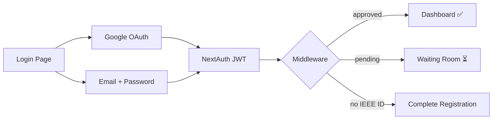

<div align="center">

# ⚡ Atrium

### IEEE Student Branch of Nirma University — Internal Portal

[](https://nextjs.org)
[](https://typescriptlang.org)
[](https://supabase.com)
[](https://authjs.dev)
[](https://atrium-ieeenirma.vercel.app)
[]()

**Event creation, membership management, and approval workflows for IEEE SBNU.**

[Live App](https://atrium-ieeenirma.vercel.app) · [Documentation](#-documentation) · [Getting Started](#-getting-started)

</div>

---

## 📋 Overview

Atrium is the internal management portal for **IEEE Student Branch of Nirma University (SBNU)**. It handles:

- **🔐 Authentication** — Google OAuth + email/password with `@nirmauni.ac.in` domain restriction
- **✅ Registration Gating** — New members require admin/MDO approval before accessing the portal
- **📊 Permission-Based Access** — Granular, position-based permissions determine what each member sees
- **📅 Event Management** — Create, submit, approve, and publish events through a multi-level approval workflow
- **👥 Membership Management** — Track positions, branches, role history, and direct permission grants
- **🔍 Audit Trail** — Immutable logs of all event and membership changes

---

## 🏗️ Tech Stack

| Layer | Technology | Purpose |
|-------|-----------|---------|
| **Framework** | [Next.js 16](https://nextjs.org) (App Router) | Full-stack React framework with Server Actions |
| **Language** | [TypeScript 5](https://typescriptlang.org) | Type-safe development |
| **Auth** | [NextAuth.js v5](https://authjs.dev) (Auth.js) | Google OAuth + Credentials with JWT sessions |
| **Database** | [Supabase](https://supabase.com) (PostgreSQL) | Managed Postgres with admin client access |
| **Styling** | [Tailwind CSS 4](https://tailwindcss.com) + [shadcn/ui](https://ui.shadcn.com) | Utility-first CSS + accessible component library |
| **Deployment** | [Vercel](https://vercel.com) | Edge-optimized hosting with auto-deploys from GitHub |
| **Icons** | [Lucide React](https://lucide.dev) | Consistent icon set |
| **Fonts** | Google Sans | Brand typography |

---

## 📁 Project Structure

```
Atrium/
├── docs/                          # 📖 Documentation
│   ├── AUTH.md                    #    Authentication & authorization deep-dive
│   └── SCHEMA.md                 #    Database schema reference (single source of truth)
│
├── implementation_plans/          # 📝 Historical implementation plans
│   ├── implementation_plan_for_auth
│   ├── implementation_plan_for_Oauth-2
│   ├── implementation_plan_for_GCP-and-NextAuth_setup
│   ├── implementation_plan_for_Dashbord-phase-1
│   └── implementation_plan-brainstorming-superadmin
│
├── supabase/
│   └── migrations/                # 🗄️ Database migrations (run in Supabase SQL editor)
│       ├── 00001_initial_schema.sql
│       ├── 00002_permission_system.sql
│       ├── 00003_nextauth_migration.sql
│       ├── 00004_invisible_superadmin.sql
│       ├── 00005_new_positions.sql
│       ├── 00006_workspace_and_requests.sql
│       ├── 00007_notification_types.sql
│       └── 00008_audit_log.sql
│
├── src/
│   ├── app/
│   │   ├── (portal)/              # 🏠 Dashboard route group (shared sidebar layout)
│   │   │   └── page.tsx           #    Dashboard home
│   │   ├── api/auth/[...nextauth] #    NextAuth API routes (auto-generated)
│   │   ├── auth/actions.ts        #    Server actions: signUp, signIn, signOut, etc.
│   │   ├── login/                 #    Login page (Google + email/password)
│   │   ├── signup/                #    Registration page
│   │   ├── complete-registration/ #    IEEE details form (Google OAuth users)
│   │   ├── pending/               #    Waiting room for unapproved accounts
│   │   ├── rejected/              #    Rejection notice with reason
│   │   ├── superadmin/            #    SuperAdmin portal (dashboard, orgs, users, positions, requests, audit, settings)
│   │   ├── layout.tsx             #    Root layout
│   │   └── globals.css            #    Theme variables & base styles
│   │
│   ├── components/
│   │   └── ui/                    #    shadcn/ui components (Button, Card, Input, etc.)
│   │
│   ├── lib/                       #    Shared utilities & query helpers
│   │
│   ├── utils/
│   │   ├── auth/
│   │   │   ├── permissions.ts     #    Permission engine (position + direct grants)
│   │   │   ├── superadmin.ts      #    SuperAdmin identity check (bcrypt-matched email → session.isSuperAdmin)
│   │   │   ├── audit.ts           #    logAdminAction() — writes to audit_log
│   │   │   └── impersonation.ts   #    Workspace impersonation (SuperAdmin "view as member")
│   │   └── supabase/
│   │       ├── server.ts          #    createAdminClient() (service role)
│   │       └── middleware.ts      #    Auth middleware (route protection)
│   │
│   ├── auth.config.ts             #    NextAuth config (Edge-safe, Google provider)
│   ├── auth.ts                    #    NextAuth config (Node.js, adds Credentials + bcrypt)
│   └── middleware.ts              #    Next.js middleware entry point
│
├── .env                           #    Environment variables (not committed)
├── package.json
├── tsconfig.json
└── next.config.ts
```

---

## 📖 Documentation

**👉 Start at [docs/README.md](docs/README.md)** — the full developer documentation index (what/how/why/gotchas for every feature). Highlights:

| Document | Description |
|----------|-------------|
| **[docs/README.md](docs/README.md)** | Documentation index & "start here" map |
| **[ARCHITECTURE.md](docs/ARCHITECTURE.md)** | System overview, request lifecycle, Edge/Node split, directory map |
| **[ENGINEERING.md](docs/ENGINEERING.md)** | Conventions, patterns, gotchas, "add a feature" recipe |
| **[DEVELOPMENT.md](docs/DEVELOPMENT.md)** | Setup, complete env-var list, migrations, verification |
| **[AUTH.md](docs/AUTH.md)** | Authentication & identity: NextAuth, Google/credentials, super-admin, middleware (current invisible-super-admin model) |
| **[PERMISSIONS.md](docs/PERMISSIONS.md)** | Positions + permissions + memberships; how access is computed |
| **[SCHEMA.md](docs/SCHEMA.md)** | Database schema reference (v2) — every table, enum, index, migration |
| **[features/](docs/features/)** | Per-feature deep dives: notifications, super-admin portal, impersonation, workspace switching, approvals, position requests, members, dashboard, events |

---

## 🚀 Getting Started

### Prerequisites

- **Node.js** 18+ 
- **npm** 9+
- A **Supabase** project ([supabase.com](https://supabase.com))
- A **Google Cloud** project with OAuth 2.0 credentials ([console.cloud.google.com](https://console.cloud.google.com))

### 1. Clone the Repository

```bash
git clone https://github.com/IEEE-Student-Branch-NU/Atrium.git
cd Atrium
```

### 2. Install Dependencies

```bash
npm install
```

### 3. Configure Environment Variables

Create a `.env` file in the project root:

```env
# ── Supabase ──────────────────────────────────────
NEXT_PUBLIC_SUPABASE_URL=https://your-project.supabase.co
SUPABASE_SERVICE_ROLE_KEY=your-service-role-key

# ── NextAuth.js ───────────────────────────────────
AUTH_SECRET=your-random-secret-string
NEXTAUTH_URL=http://localhost:3000
NEXT_PUBLIC_APP_URL=http://localhost:3000

# ── Google OAuth ──────────────────────────────────
AUTH_GOOGLE_ID=your-google-client-id.apps.googleusercontent.com
AUTH_GOOGLE_SECRET=GOCSPX-your-google-client-secret

# ── Password Hashing ─────────────────────────────
BCRYPT_SALT_ROUNDS=12

# ── Email (Resend) — optional ─────────────────────
# Powers email delivery for high-signal notifications (welcome, approvals,
# promotions). If unset, the app runs normally and email sends are a no-op.
RESEND_API_KEY=re_your_resend_api_key
EMAIL_FROM=Atrium <no-reply@your-verified-domain>
```

> **Google OAuth Setup:** In the Google Cloud Console, add `http://localhost:3000` to **Authorized JavaScript Origins** and `http://localhost:3000/api/auth/callback/google` to **Authorized Redirect URIs**. See [AUTH.md](docs/AUTH.md) for details.

### 4. Set Up the Database

Run the migrations **in order** in your Supabase SQL editor:

1. `supabase/migrations/00001_initial_schema.sql` — Core tables, branches, positions, events
2. `supabase/migrations/00002_permission_system.sql` — Permissions, position_permissions, pre-approval
3. `supabase/migrations/00003_nextauth_migration.sql` — NextAuth-specific columns (password_hash)
4. `supabase/migrations/00004_invisible_superadmin.sql` — Superadmins table
5. `supabase/migrations/00005_new_positions.sql` — Seeds Web Master, Treasurer, Technical Associate, Marketing Associate positions
6. `supabase/migrations/00006_workspace_and_requests.sql` — position_requests, notifications tables
7. `supabase/migrations/00007_notification_types.sql` — notifications.type column
8. `supabase/migrations/00008_audit_log.sql` — Unified `audit_log` table for the SuperAdmin portal (required for `/superadmin/audit` to show data)
9. `supabase/migrations/00009_broadcast_notifications.sql` — Broadcast notifications + realtime publication + RLS
10. `supabase/migrations/00010_hardcoded_superadmin_profile.sql` — Seeds the fixed super-admin profile row
11. `supabase/migrations/00011_notification_routing.sql` — Notification routing: `audience`/`branch_id`/`event_key`/`actor_profile_id`, Chair-scoped RLS (required for the notification system)

### 5. Start Development Server

```bash
npm run dev
```

Open [http://localhost:3000](http://localhost:3000) — you'll see the login page.

---

## 🔐 Authentication Overview

Atrium supports two authentication methods, both restricted to `@nirmauni.ac.in`:



**New users must be approved** by an Admin or MDO before accessing the portal. Pre-approved IEEE Membership IDs skip the queue automatically.

→ **Full details:** [docs/AUTH.md](docs/AUTH.md)

---

## 🗄️ Database

The database uses **PostgreSQL via Supabase** with a permission-based access control system.

### Key Tables

| Table | Purpose |
|-------|---------|
| `profiles` | User identity, status, IEEE membership |
| `branches` | IEEE organizational hierarchy (SBNU → CS, WIE, SIGHT, etc.) |
| `positions` | Branch-scoped titles (Chair, Vice Chair, MDO, etc.) |
| `permissions` | Atomic actions (create_events, approve_registrations, etc.) |
| `memberships` | Append-only history: who held what position, when |
| `events` | Core event entity with status machine |
| `event_approvals` | Multi-level approval tracking |

### Branches (Seeded)

| Branch | Slug | Parent |
|--------|------|--------|
| IEEE SBNU | `sbnu` | — (root) |
| IEEE SIGHT | `sight` | SBNU |
| IEEE WIE | `wie` | SBNU |
| IEEE CS | `cs` | SBNU |
| IEEE ITSS | `itss` | SBNU |
| IEEE SPS | `sps` | SBNU |

→ **Full schema reference:** [docs/SCHEMA.md](docs/SCHEMA.md)

---

## 🛡️ Permission System

Permissions are **position-based + direct grants**. The system follows the principle of least privilege.

| Permission | Chair | Vice Chair | Gen Sec | Tech Head | Creative Head | MDO |
|:-----------|:-----:|:----------:|:-------:|:---------:|:-------------:|:---:|
| `create_events` | ✅ | ✅ | ✅ | ✅ | ✅ | |
| `approve_events` | ✅ | ✅ | | | | |
| `manage_events` | ✅ | ✅ | | | | |
| `manage_members` | ✅ | ✅ | | | | |
| `approve_registrations` | ✅ | ✅ | | | | ✅ |
| `view_members` | ✅ | ✅ | | ✅ | ✅ | ✅ |
| `view_audit_log` | ✅ | ✅ | ✅ | | | |

> New positions (Treasurer, Web Master, Technical Associate, Marketing Associate) start with no default permissions. An admin can grant them via the Manage Members module.

→ **Full permission engine details:** [docs/AUTH.md#6-permission-engine](docs/AUTH.md#6-permission-engine)

---

## 🚢 Deployment

The app is deployed on **Vercel** with auto-deploys from the `main` branch.

| Environment | URL |
|-------------|-----|
| **Production (Vercel)** | [atrium-ieeenirma.vercel.app](https://atrium-ieeenirma.vercel.app) |
| **Custom Domain** | [atrium.ieeenirma.org](https://atrium.ieeenirma.org) |
| **Local** | [localhost:3000](http://localhost:3000) |

### Vercel Environment Variables

Set all variables from the `.env` section above in **Vercel → Project Settings → Environment Variables**. For production, update:

```
NEXTAUTH_URL=https://atrium-ieeenirma.vercel.app
NEXT_PUBLIC_APP_URL=https://atrium-ieeenirma.vercel.app
```

### Google OAuth Production URIs

In the Google Cloud Console, add these to your OAuth Client:

- **Authorized JavaScript Origins:** `https://atrium-ieeenirma.vercel.app`, `https://atrium.ieeenirma.org`
- **Authorized Redirect URIs:** `https://atrium-ieeenirma.vercel.app/api/auth/callback/google`, `https://atrium.ieeenirma.org/api/auth/callback/google`

---

## 📜 Migration History

| # | Migration | Description |
|---|-----------|-------------|
| 1 | `00001_initial_schema.sql` | Core tables: profiles, branches, positions, memberships, events, event_types, event_approvals, audit logs. Seeded branches and positions. |
| 2 | `00002_permission_system.sql` | Permission engine: permissions, position_permissions, member_permissions, pre_approved_members. Dropped old portal_role enum. Full permission matrix seed. |
| 3 | `00003_nextauth_migration.sql` | Added password_hash to profiles. NextAuth compatibility columns. |
| 4 | `00004_invisible_superadmin.sql` | Created `superadmins` table (bcrypt-hashed emails + passphrase hash), RLS enabled with no public policies. **Dropped `profiles.is_super_admin`** — SuperAdmin status is no longer a queryable column. |
| 5 | `00005_new_positions.sql` | Seed script for adding missing standard roles: Web Master, Treasurer, Technical Associate, Marketing Associate, and granting basic permissions. |
| 6 | `00006_workspace_and_requests.sql` | Added `bio`/`skills` to profiles. Added `position_requests` table (member-initiated requests to hold a position) and `notifications` table. |
| 7 | `00007_notification_types.sql` | Added `notifications.type` column (normal, broadcast, success, warning, error). |
| 8 | `00008_audit_log.sql` | Added unified `audit_log` table recording super-admin/structural actions (branch/position/permission changes, workspace impersonation, etc.), with indexes on `created_at`, `actor_profile_id`, and `(entity_type, entity_id)`. RLS enabled with no public policies (service-role only). |

---

## 🧑‍💻 Development

### Scripts

| Command | Description |
|---------|-------------|
| `npm run dev` | Start development server (hot reload) |
| `npm run build` | Production build |
| `npm run start` | Start production server |
| `npm run lint` | Run ESLint |

### Adding shadcn/ui Components

```bash
npx shadcn@latest add <component-name>
```

### Code Conventions

- **Server Actions** for all mutations (no API routes for forms)
- **Server Components** by default; `'use client'` only when needed
- **Supabase Admin Client** for all DB access (never browser client)
- **bcrypt** for password hashing (Node.js runtime only)
- **JWT sessions** (no database sessions)

## 🤖 AI Agents & Graphify

This repository is configured to be used with AI coding assistants (like Claude, Cursor, Aider, Copilot, or Antigravity) using **Graphify**. 
Graphify maps the codebase into a queryable knowledge graph, giving your AI agents a deep understanding of the project's architecture and inter-dependencies out-of-the-box.

When you clone the repository, open it in your AI coding assistant of choice and run:
```bash
/graphify .
```
(Or run `graphify extract .` via CLI). The agent will automatically use the generated graph for all codebase-related questions.

### 🛠️ Quality Squad (Claude Code subagents)

The repo ships a squad of checked-in Claude Code agents (`.claude/agents/`) that continuously
maintain the portal's standards through an orchestrated **design → build → test → review → perf**
flow. A `product-manager` orchestrates; `system-design-engineer`, `db-engineer`, `backend-engineer`,
`code-tester`, `performance-auditor`, and `code-reviewer` are the specialists. They encode Atrium's
real invariants (service-role/RLS-bypass safety, request-level `cache()`, append-only history,
edge-safety, manual migrations, the build+test gate, the ~100 ms response budget).

| Doc | What it covers |
|-----|----------------|
| **[.claude/agents/README.md](.claude/agents/README.md)** | Roster, interaction model, flow diagram, how to invoke |
| **[.claude/agents/agent-docs.md](.claude/agents/agent-docs.md)** | Design rationale, orchestration, tool/model choices, trade-offs & thought process |

---

## 👥 Team

**IEEE Student Branch of Nirma University**

- Organization: [IEEE-Student-Branch-NU](https://github.com/IEEE-Student-Branch-NU)
- Repository: [Atrium](https://github.com/IEEE-Student-Branch-NU/Atrium)

---

<div align="center">
  <sub>Built with ❤️ by IEEE SBNU</sub>
</div>
