# Atrium — Authentication & Authorization Documentation

> **Last Updated:** July 2026 | **Auth Library:** NextAuth.js v5 (Auth.js) | **Database:** Supabase (PostgreSQL)

This document is the definitive reference for how authentication and authorization work in the Atrium portal. It covers every file, every flow, and every security decision.

> **⚠️ Model update (read first).** The original "sudo mode" (a passphrase-gated `/sudo` route setting an elevation cookie) has been **removed**. Super-admin is now: (a) an **invisible identity** — real `@nirmauni.ac.in` accounts whose email bcrypt-matches the `superadmins` table, OR an env-fixed username/password login — surfaced as `session.isSuperAdmin`, and (b) a dedicated **`/superadmin` console** with **workspace impersonation**. §7 below documents the current model; the retired `/sudo`/`sudo.ts` pieces are gone. Authorization (positions/permissions) now has its own doc: **[PERMISSIONS.md](PERMISSIONS.md)**. Super-admin console + impersonation deep-dives: **[features/superadmin-portal.md](features/superadmin-portal.md)** and **[features/impersonation.md](features/impersonation.md)**.

---

## Table of Contents

1. [Architecture Overview](#1-architecture-overview)
2. [Technology Decisions](#2-technology-decisions)
3. [File Map](#3-file-map)
4. [Authentication Flows](#4-authentication-flows)
5. [Middleware & Route Protection](#5-middleware--route-protection)
6. [Permission Engine](#6-permission-engine)
7. [Super-Admin (current model)](#7-super-admin-current-model--replaces-sudo-mode)
8. [Security Considerations](#8-security-considerations)
9. [Environment Variables](#9-environment-variables)

---

## 1. Architecture Overview

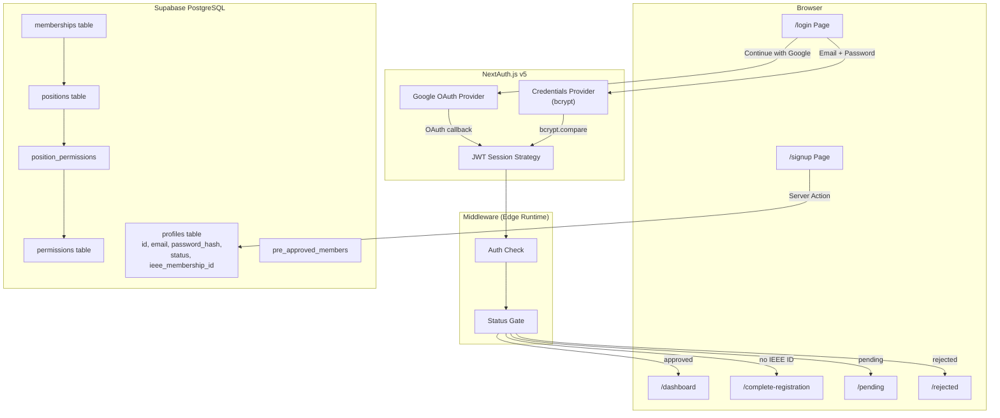

**Key Principle:** NextAuth handles session management (JWT). Supabase is the database only — we use the **service role key** (admin client) for all DB access. No Supabase Auth, no RLS. This is intentional: NextAuth gives us full control over the auth flow while Supabase provides the PostgreSQL backend.

---

## 2. Technology Decisions

| Decision | Choice | Why |
|----------|--------|-----|
| **Auth library** | NextAuth.js v5 (Auth.js) | Industry standard for Next.js. Handles OAuth, JWT, session management. Edge-compatible. |
| **Session strategy** | JWT (not database sessions) | Stateless, fast, works at the Edge for middleware. No session table needed. |
| **Password hashing** | bcrypt (12 rounds) | Battle-tested, slow-by-design, resistant to brute force. Cannot run at Edge — so Credentials provider lives in `auth.ts` (Node runtime only). |
| **OAuth provider** | Google (GCP) | All members have `@nirmauni.ac.in` Google Workspace accounts. The `hd` param locks it to this domain. |
| **Database access** | Supabase Admin Client (service role) | Bypasses RLS entirely. All access is server-side via Server Actions and API routes. The service role key is NEVER exposed to the browser. |
| **Domain restriction** | `@nirmauni.ac.in` only | Enforced at 3 levels: (1) Google OAuth `hd` param, (2) Email signup validation, (3) Middleware redirect. |
| **Registration gating** | `pending` → `approved` / `rejected` | Not every Nirma student should get portal access. Only IEEE members. An admin/MDO must approve after verifying the IEEE Membership ID. |

---

## 3. File Map

### Core Auth Files

| File | Runtime | Purpose |
|------|---------|---------|
| `src/auth.config.ts` | **Edge** | Google provider config, JWT/session callbacks. Importable in middleware (no Node.js deps). |
| `src/auth.ts` | **Node.js** | Adds Credentials provider (uses bcrypt). Exports `auth`, `signIn`, `signOut`, `handlers`. |
| `src/middleware.ts` | **Edge** | Entry point for Next.js middleware. Delegates to `authMiddleware`. |
| `src/utils/supabase/middleware.ts` | **Edge** | The actual middleware logic: auth checks, status-based routing. |

### Server Actions

| File | Purpose |
|------|---------|
| `src/app/auth/actions.ts` | All auth server actions: `signInWithGoogle`, `signInWithEmail`, `signUp`, `completeRegistration`, `signOut` |

### Auth Utility Files

| File | Purpose |
|------|---------|
| `src/utils/supabase/server.ts` | `createAdminClient()` — Supabase client with service role key |
| `src/utils/supabase/token.ts` | `createSupabaseToken(profileId)` — mints the HS256 JWT (`sub`=profileId) used by the browser for **Realtime** (RLS `auth.uid()`) |
| `src/utils/auth/permissions.ts` | Permission engine: `getUserPermissions`, `hasPermission`, `checkPermission`, `canApproveRegistrations` — see [PERMISSIONS.md](PERMISSIONS.md) |
| `src/utils/auth/superadmin.ts` | `isSuperAdmin(email)` (bcrypt vs `superadmins`), `matchesSuperAdmin` (pure, tested), `getEffectiveActor()` |
| `src/utils/auth/impersonation.ts` | `setImpersonation`/`getImpersonatedMembershipId`/`clearImpersonation` — the `atrium_impersonate` JWT cookie |
| `src/utils/auth/effective-actor.ts` | `resolveEffectiveActor()` — pure logic: acting-as vs real actor during impersonation |
| `src/utils/auth/workspace.ts` | `setActiveWorkspace`/`getActiveWorkspace`/`clearActiveWorkspace` — the `atrium_workspace_id` cookie |
| `src/utils/auth/audit.ts` | `logAdminAction()` — best-effort write to `audit_log` |

### Auth-Related Pages

| Route | File | Type | Purpose |
|-------|------|------|---------|
| `/login` | `src/app/login/page.tsx` + `login-form.tsx` | Client | Login with Google OAuth or email/password |
| `/signup` | `src/app/signup/page.tsx` | Client | Email/password registration with IEEE details |
| `/complete-registration` | `src/app/complete-registration/page.tsx` | Client | Google OAuth users fill in IEEE membership ID, branch, role |
| `/pending` | `src/app/pending/page.tsx` | Server | Waiting room for unapproved accounts |
| `/rejected` | `src/app/rejected/page.tsx` | Server | Shows rejection reason, contact info |
| `/superadmin/login` | `src/app/superadmin/login/page.tsx` + `superadmin-login-form.tsx` | Client | Super-admin sign-in (fixed username/password **or** an invisible `superadmins` email); sets `isSuperAdminLogin` |
| `/api/auth/[...nextauth]` | Auto-generated by NextAuth | API | OAuth callback endpoint |

### Edge vs Node.js Runtime Split

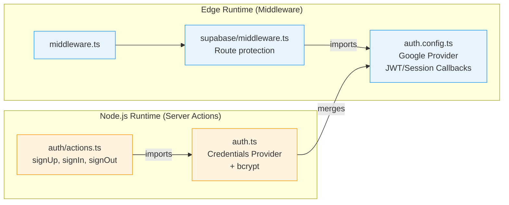

> **Why the split?** `bcrypt` is a native Node.js module that **cannot** run at the Edge. The middleware imports only `auth.config.ts` (Edge-safe), while Server Actions import `auth.ts` which adds the Credentials provider with bcrypt.

---

## 4. Authentication Flows

### 4.1 Google OAuth — Full Flow

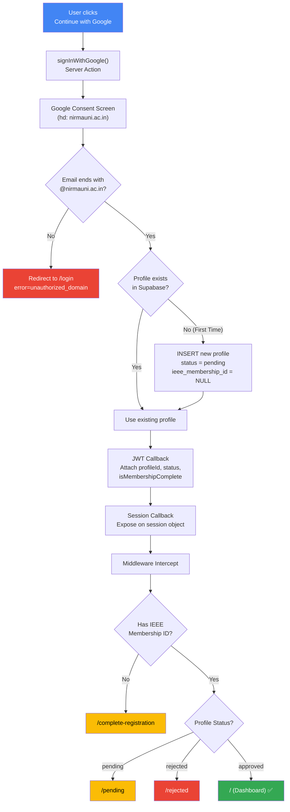

### 4.2 Complete Registration (Google OAuth Users)

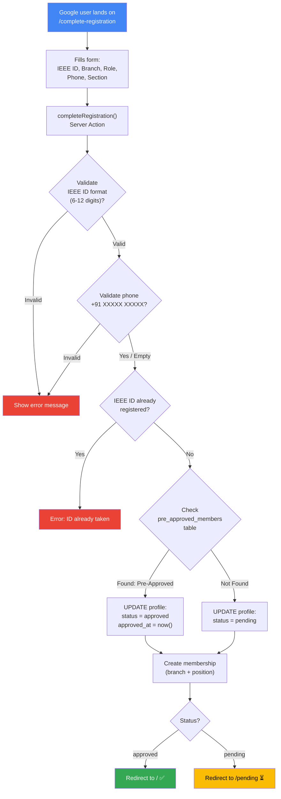

### 4.3 Email/Password Signup — Full Flow

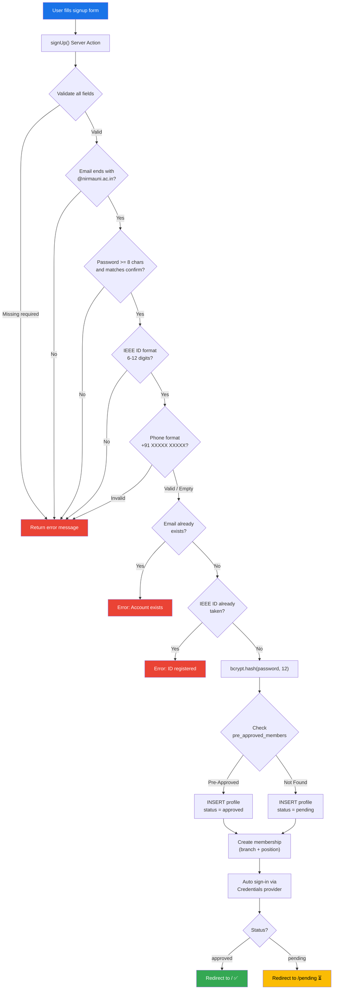

### 4.4 Email/Password Login

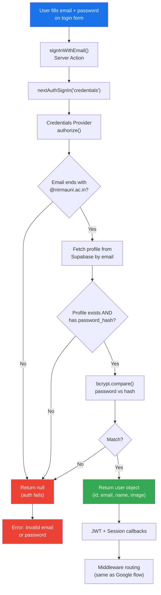

### 4.5 Sign Out

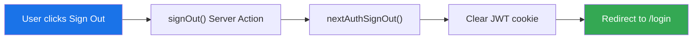

---

## 5. Middleware & Route Protection

### Route Categories

| Category | Routes | Auth Required | Approval Required |
|----------|--------|:------------:|:-----------------:|
| **Public** | `/login`, `/signup`, `/api/auth/*` | No | No |
| **Auth-Only** | `/pending`, `/rejected`, `/complete-registration` | Yes | No |
| **Protected** | `/` and everything else | Yes | Yes |

### Middleware Decision Tree

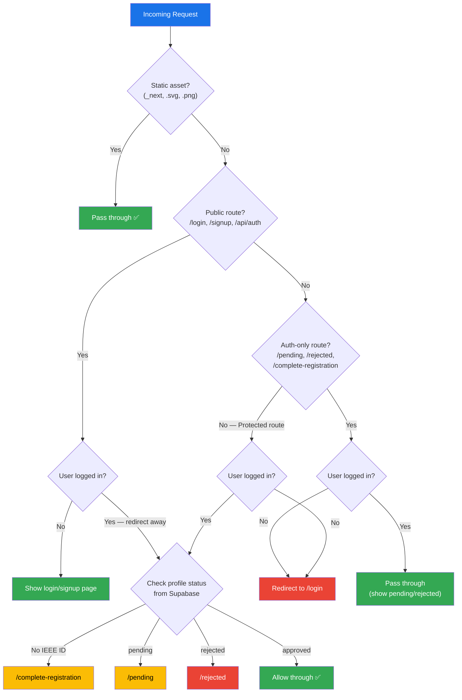

---

## 6. Permission Engine

### How Permissions Are Resolved

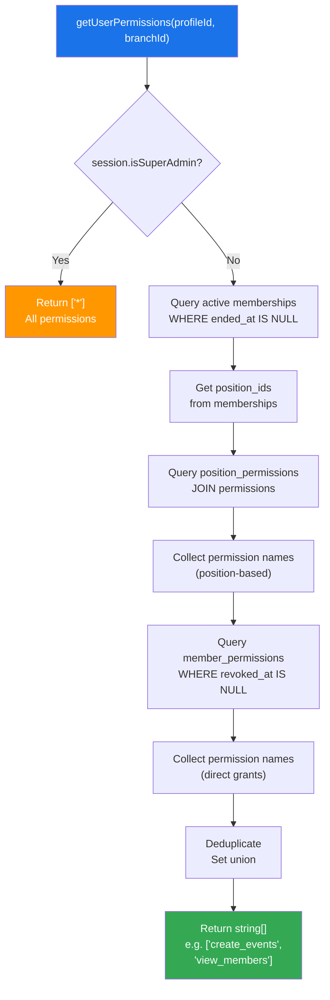

### Permission Resolution Data Flow

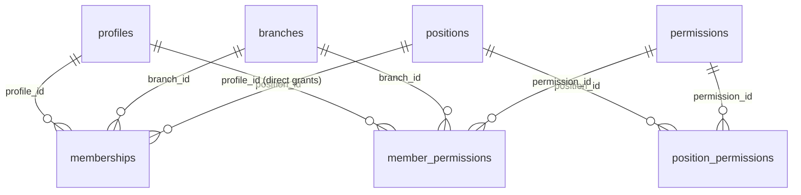

### Available Permissions

| Permission | Description |
|-----------|-------------|
| `create_events` | Create event drafts in a branch |
| `approve_events` | Approve or reject pending events |
| `manage_events` | Edit or delete any event in the branch |
| `manage_members` | Assign positions and grant permissions |
| `approve_registrations` | Approve or reject new member signups |
| `view_members` | View member list and role history |
| `view_audit_log` | Access the audit trail |
| `manage_event_types` | Add or edit event categories |
| `manage_positions` | Create custom positions for the branch |

### Usage Pattern

```typescript
import { getUserPermissions, hasPermission } from '@/utils/auth/permissions'
import { createAdminClient } from '@/utils/supabase/server'

const supabase = createAdminClient()
const perms = await getUserPermissions(supabase, profileId, branchId)

if (hasPermission(perms, 'approve_registrations')) {
  // show approval queue
}
```

---

## 7. Super-Admin (current model — replaces "sudo mode")

> The passphrase-gated `/sudo` elevation flow shown in older versions of this doc has been **removed**. There is no `/sudo` route, no `sudo.ts`, and no `sudo_mode` cookie. Super-admin now works as described here. Console + impersonation: [features/superadmin-portal.md](features/superadmin-portal.md), [features/impersonation.md](features/impersonation.md).

### Two ways to be a super-admin (both → `session.isSuperAdmin === true`)

1. **Invisible identity** — a real `@nirmauni.ac.in` account whose **email bcrypt-matches** a row in the `superadmins` table (seeded in migration `00004`, RLS-locked to the service role). Checked by `isSuperAdmin(email)` in `src/utils/auth/superadmin.ts`, which loads all `superadmins.hashed_email` rows and bcrypt-compares. Requires **zero env vars** — the emails are hashed inline.
2. **Fixed username/password** — `SUPERADMIN_USERNAME` / `SUPERADMIN_PASSWORD` (env), matched entirely in code in `src/auth.ts` (synthetic id `11111111-…`, backed by a seeded `profiles` row from migration `00010` for FK integrity). Inert if the env vars are unset.

**Both require the `/superadmin/login` form**, which sets `isSuperAdminLogin: 'true'`. This is important:

> **Gotcha:** a person in the `superadmins` table who logs in via the **normal `/login`** form authenticates as an ordinary user with **no** super-admin powers — the flag is only set on the super-admin login form. Use `/superadmin/login`.

### How the flag flows

`authorize()` (Node runtime, bcrypt) validates and marks the user `isSuperAdminLogin`. The `jwt()` callback stamps `token.isSuperAdmin` **once at sign-in** (bcrypt can't run at the Edge, so it's never recomputed per-request). The `session()` callback exposes `session.isSuperAdmin`. Middleware and `requireSuperAdmin()` read that flag.

### Access & impersonation

- The `/superadmin` console is gated by `session.isSuperAdmin` at three layers (middleware, layout, per-action `requireSuperAdmin()`).
- Super-admins can **impersonate** any user's workspace ("Open Workspace") via a signed `atrium_impersonate` cookie; reads act as the target while mutations are attributed to the real super-admin. See [features/impersonation.md](features/impersonation.md).

### Why this design

- **No plaintext super-admin emails** in the DB — even a DB reader can't enumerate the super-admins (bcrypt-hashed, RLS-locked).
- **Invisible in `profiles`** — the old `is_super_admin` boolean was dropped (`00004`); status can't be discovered by joining `profiles`.
- **Fixed login needs no email/Google account** and its secret lives only in env, so the public repo never contains a working credential.

> **Security note:** migration `00004` seeds super-admins with a **default shared passphrase** (`ieee_sudo_2026`, visible in the file). For any real deployment, rotate `superadmins.passphrase_hash` and set strong `SUPERADMIN_USERNAME/PASSWORD`.

---

## 8. Registration Approval & Pre-Approval

### Approval Lifecycle

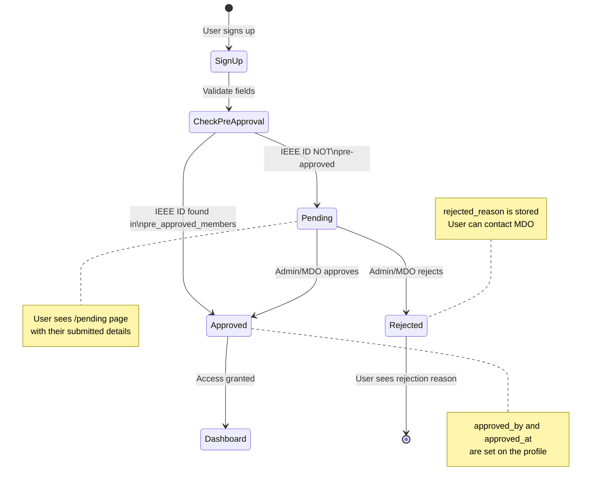

### Pre-Approval System

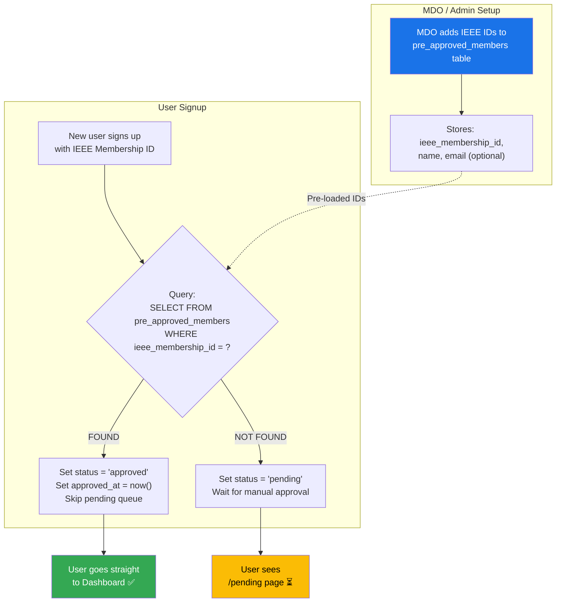

### Manual Approval Flow (Admin/MDO)

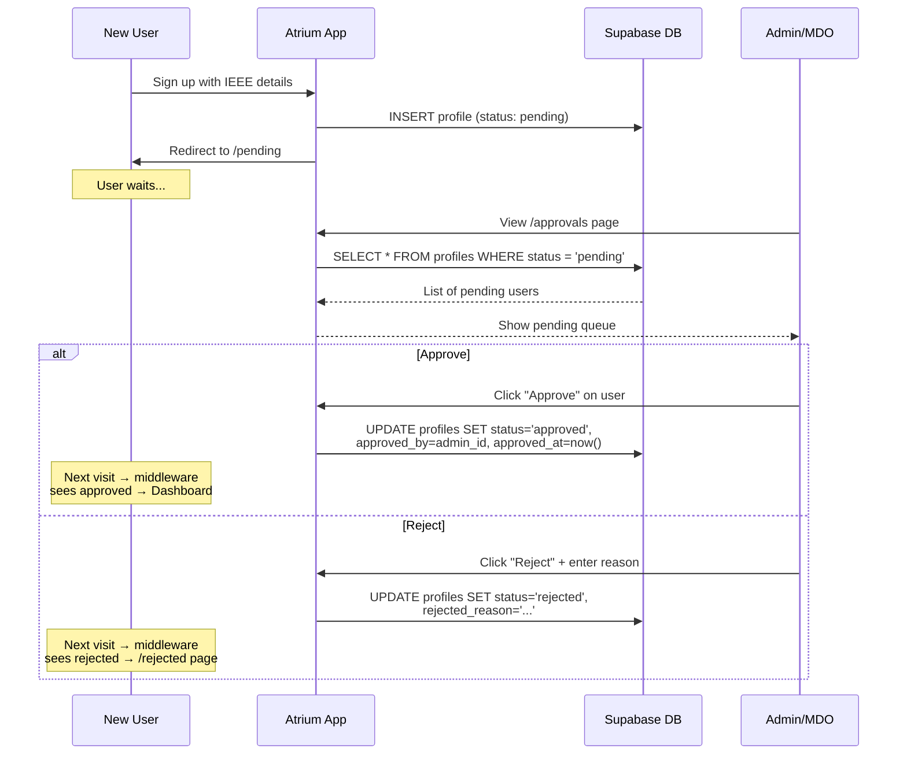

---

## 9. Security Considerations

| Threat | Mitigation |
|--------|------------|
| Non-Nirma users signing up | Domain check at 3 levels: Google OAuth `hd` param, signup validation, middleware |
| Brute force password attacks | bcrypt with 12 salt rounds (~250ms per hash) |
| Unauthorized portal access | Middleware checks `status = 'approved'` on every protected request |
| Session hijacking | JWT with `AUTH_SECRET`, httpOnly cookies, secure flag in production |
| SuperAdmin credential exposure | Invisible identity: bcrypt-hashed emails in `superadmins` (RLS-locked, no env vars). Fixed login: secret only in env, never in the repo. |
| Service role key exposure | Only used in server-side code (`createAdminClient`), never sent to browser |
| CSRF on server actions | Next.js Server Actions have built-in CSRF protection |
| Duplicate IEEE membership IDs | UNIQUE constraint in database + pre-insert check |

### Domain Enforcement — Triple Layer

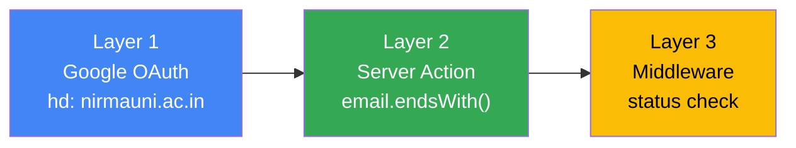

---

## 10. Environment Variables

> Full list (incl. realtime + email) in [DEVELOPMENT.md](DEVELOPMENT.md). Auth-relevant ones:

| Variable | Used By | Purpose |
|----------|---------|---------|
| `NEXT_PUBLIC_SUPABASE_URL` | `createAdminClient()` / browser | Supabase project URL |
| `SUPABASE_SERVICE_ROLE_KEY` | `createAdminClient()` | Admin access (bypasses RLS) |
| `NEXT_PUBLIC_SUPABASE_ANON_KEY` | browser Realtime client | Anon key for the websocket client |
| `SUPABASE_JWT_SECRET` | `createSupabaseToken` | Signs the browser JWT (`sub`=profileId) for notification RLS |
| `AUTH_SECRET` | NextAuth + impersonation | Signs JWT sessions **and** the `atrium_impersonate` cookie |
| `AUTH_GOOGLE_ID` | NextAuth Google provider | Google OAuth Client ID |
| `AUTH_GOOGLE_SECRET` | NextAuth Google provider | Google OAuth Client Secret |
| `BCRYPT_SALT_ROUNDS` | `signUp()` / password change | Password hashing cost (default: 12) |
| `SUPERADMIN_USERNAME` / `SUPERADMIN_PASSWORD` | `src/auth.ts` | Fixed super-admin login (inert if unset) |
| `NEXTAUTH_URL` | NextAuth | Canonical app URL for callbacks |
| `NEXT_PUBLIC_APP_URL` | frontend / email links | Public-facing app URL |

---

## Appendix: Database Tables Used by Auth

| Table | Auth Role |
|-------|-----------|
| `profiles` | Core identity: email, password_hash, status, ieee_membership_id (the `is_super_admin` column was **dropped** in `00004`) |
| `pre_approved_members` | Auto-approval whitelist: IEEE IDs that skip the pending queue |
| `superadmins` | bcrypt-hashed emails (+ legacy passphrase_hash) for the invisible super-admin identity |
| `memberships` | Links users to branches + positions (determines permissions) |
| `positions` | Branch-scoped titles (Chair, MDO, Technical Head, etc.) |
| `permissions` | Atomic actions (create_events, approve_registrations, etc.) |
| `position_permissions` | Maps positions → permissions |
| `member_permissions` | Direct ad-hoc permission grants to individuals |
